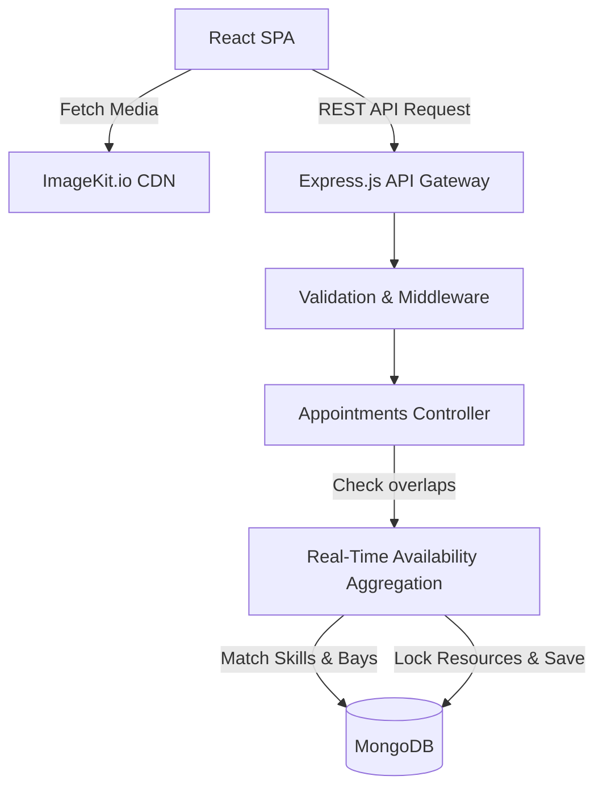

# Keyloop Technical Assessment: The Unified Service Scheduler

**Scenario A** • **Domain:** Ownership

## 1. Project Overview

This repository contains the solution for **Scenario A: The Unified Service Scheduler**. The goal is to replace manual automotive booking systems with a streamlined, resource-constrained scheduling application. 

**Architectural Inspiration:** The technical foundation of this project is inspired by the comprehensive tutorial: 
> *(2) Build and Deploy a Full Stack Car Rental Booking App using React js & ImageKit | MERN Stack Project - YouTube*
> 
> The core concepts from that single-asset booking application have been heavily adapted to meet the complex, multi-asset constraints (Technician + Service Bay) required for Keyloop's dealership service environment.

### Core Requirements Addressed
1. **Resource Constrained Booking:** Users can request a service appointment for a specific vehicle, service type, and dealership at a desired time.
2. **Real-Time Availability Check:** The system verifies the simultaneous availability of a ServiceBay and a qualified Technician for the entire service duration before confirming.
3. **Confirmed Appointment Record:** Upon success, a persistent `Appointment` record is created, securely linking the customer, vehicle, technician, and service bay.

---

## 2. System Design Document

The system utilizes a decoupled Client-Server architecture built on the MERN stack, with external media management.

### 2.1 Architecture Diagram



### 2.2 Technology Stack

| Layer | Technology | Justification |
| :--- | :--- | :--- |
| **Frontend** | React (Vite) & TypeScript | Component-driven UI for building a dynamic, multi-step booking wizard. TypeScript ensures type safety across API payloads. |
| **Media Management** | ImageKit.io | Integrated for optimized image delivery. Used for rendering customer vehicle photos, technician avatars, and dealership service bay layouts with automatic format conversion. |
| **Backend API** | Node.js & Express.js | Lightweight, non-blocking runtime ideal for handling concurrent booking requests and REST API routing. |
| **Database** | MongoDB & Mongoose | Document-based structure allows for flexible storage of complex appointment associations linking customers, bays, and technicians. |

### 2.3 Documented Assumptions (Addressing Ambiguity)
* **Standardized Durations:** The duration of an appointment is derived entirely from the `serviceType` (e.g., Oil Change = 1 hour) rather than user input.
* **Concurrency:** In the event of race conditions (two users booking the exact same slot), the database relies on optimistic concurrency control to reject the second incoming request.

---

## 3. Data Flow & Core Database Schemas

### The Booking Lifecycle
1. **Selection & Media Retrieval:** The user selects their vehicle and service type. ImageKit serves optimized thumbnail images.
2. **Availability Check (`GET /api/availability`):** The React client queries the Express backend for available time slots based on duration.
3. **Resource Constraint Validation:** The backend runs a MongoDB aggregation pipeline. A slot is returned as "Available" *only* if both a `Technician` (with the required skill) and a `ServiceBay` are unbooked for the requested time.
4. **Confirmation (`POST /api/appointments`):** The user confirms the booking. The backend locks the resources and persists the record.

### Core Database Schemas (MongoDB)

**1. `Technician`**
```json
{
  "_id": "ObjectId",
  "name": "String",
  "avatarUrl": "String", // Hosted on ImageKit
  "skills": ["Diagnostics", "Oil Change", "Brakes"]
}
```

**2. `ServiceBay`**
```json
{
  "_id": "ObjectId",
  "bayNumber": "String",
  "imageUrl": "String", // Hosted on ImageKit
  "isActive": "Boolean"
}
```

**3. `Appointment` (Source of Truth)**
```json
{
  "_id": "ObjectId",
  "customerId": "ObjectId",
  "vehicleId": "String",
  "serviceType": "String",
  "technicianId": "ObjectId",
  "serviceBayId": "ObjectId",
  "startTime": "ISODate",
  "endTime": "ISODate",
  "status": "Confirmed"
}
```

---

## 4. AI Collaboration Narrative

Generative AI tools (like Google Gemini and GitHub Copilot) were utilized as essential pair-programmers during the development of this full-stack application.

* **Architectural Bridging:** I utilized AI to help map the logic of a standard "Car Rental Booking" flow (booking a single asset) to the more complex Keyloop requirement of a "Service Booking" flow (simultaneously booking two assets). 
* **Backend Query Optimization:** I directed the AI to generate the initial Mongoose queries for the real-time availability check. When the AI suggested fetching all records into memory to find overlaps, I refined its prompt to mandate a MongoDB Aggregation Pipeline, ensuring the filtering happened efficiently at the database level.
* **ImageKit Integration:** AI tools generated the boilerplate for integrating the ImageKit React SDK, allowing me to focus on wiring up the business logic for the booking constraints rather than debugging media upload workflows.
* **Testing:** I independently wrote the critical path tests for the availability algorithm *before* accepting the AI's functional code (Test-Driven Development) to ensure absolute compliance with the assessment requirements.

---

## 5. Setup & Installation Instructions

### Prerequisites
* Node.js (v18+)
* MongoDB URI (Local or Atlas)
* ImageKit.io Account (for media management)

### 1. Clone & Install
```bash
git clone <repository_url>
cd keyloop-service-scheduler

# Install Server Dependencies
cd server
npm install

# Install Client Dependencies
cd ../client
npm install
```

### 2. Environment Configuration
Create a `.env` file in the **`/server`** directory:
```env
PORT=5000
MONGO_URI=your_mongodb_connection_string
```

Create a `.env` file in the **`/client`** directory:
```env
VITE_API_BASE_URL=http://localhost:5000/api
VITE_IMAGEKIT_URL_ENDPOINT=https://ik.imagekit.io/your_endpoint
VITE_IMAGEKIT_PUBLIC_KEY=your_public_key
```

### 3. Run the Application
Open two terminal windows:

**Terminal 1 (Backend):**
```bash
cd server
npm run dev
```

**Terminal 2 (Frontend):**
```bash
cd client
npm run dev
```

### 4. Run the Test Suite
The core business logic (specifically the Real-Time Availability Check and Resource Allocation) is heavily unit tested to ensure booking integrity.

```bash
# Run backend tests (Jest/Supertest)
cd server
npm run test
```

