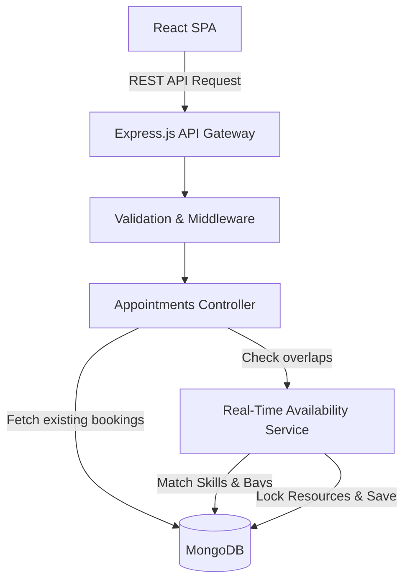

# Keyloop Coding Challenge: The Unified Service Scheduler

Scenario A: The Unified Service Scheduler 
• Domain: Ownership 
• Task: Build an Appointment Scheduler application to replace manual booking 
systems. 
• Core Requirements: 
1. Resource Constrained Booking: Allow a user to request a service 
appointment for a specific vehicle, service type, and dealership at a 
desired time.
2. Real-Time Availability Check: Before confirming, check for the 
availability of both a ServiceBay and a qualified Technician for the entire 
service duration. 
3. Confirmed Appointment Record: Upon success, create a persistent 
Appointment record associating the customer, vehicle, technician, and 
service bay.

## 1. Project Overview

[cite_start]This repository contains the solution for **Scenario A: The Unified Service Scheduler**[cite: 19]. 

* [cite_start]**Domain:** Ownership [cite: 20]
* [cite_start]**Task:** Build an Appointment Scheduler application to replace manual booking systems[cite: 21].
* **Implementation Focus:** Frontend Service Layer (React SPA) fully implemented with a mocked/stubbed RESTful Backend (Node.js/Express) and MongoDB data structures.

### Core Requirements Addressed
1. [cite_start]**Resource Constrained Booking:** Users can request a service appointment for a specific vehicle, service type, and dealership at a desired time[cite: 23].
2. [cite_start]**Real-Time Availability Check:** The system checks for the availability of both a ServiceBay and a qualified Technician for the entire service duration before confirming[cite: 27].
3. [cite_start]**Confirmed Appointment Record:** Upon success, a persistent Appointment record is created, associating the customer, vehicle, technician, and service bay[cite: 28].

---

## 2. System Architecture & Data Flow

The system follows a modern decoupled Client-Server architecture, utilizing the MERN stack.

### Architecture Diagram



### Data Flow (The Booking Process)
1. **Initiation:** The user selects a vehicle, service type, and preferred time via the React UI.
2. **Availability Request:** The client dispatches a `GET /api/v1/availability` request to the backend to fetch available time slots.
3. **Cross-Check (Backend):** The Express Service layer queries MongoDB to verify if *both* a Technician and a Service Bay are free for the requested duration.
4. **Confirmation:** If available, the user finalizes the booking, triggering a `POST /api/v1/appointments` payload.
5. **Persistence:** The backend validates the payload, uses optimistic concurrency control to prevent double-booking, saves the `Appointment` document, and returns a `201 Created` response.
6. **State Update:** The React frontend updates the global Zustand state and displays a success confirmation.

---

## 3. Technology Stack & Justifications

| Layer | Technology | Justification |
| :--- | :--- | :--- |
| **Frontend** | React & TypeScript | Provides a component-driven architecture. TypeScript ensures type safety, reducing runtime errors when mapping data payloads. |
| **State Management** | Zustand & React Query | Zustand handles the multi-step booking wizard state. React Query handles server-state caching for availability slots. |
| **Styling** | Tailwind CSS | Utility-first styling utilized to implement a custom "Dark Mode" interface with a rustic/vintage mechanic aesthetic, ensuring the tool feels native to a garage environment. |
| **Backend** | Node.js & Express.js | Highly performant for I/O bound tasks, lightweight, and uses a unified language (JavaScript/TypeScript) across the stack. |
| **Database** | MongoDB & Mongoose | Flexible document schema accommodates dynamic booking metadata without rigid relational migrations. |

---

## 4. Technical Implementation Details

### UI/UX Design Strategy
To align with the automotive retail experience, the interface features a specialized **Dark Mode** design. It utilizes deep charcoal backgrounds, metallic grey borders, and monospace typography for technical data (like VINs) to create an authentic industrial feel. 

### Core Database Schemas (Mongoose)

To handle the complex constraints, the database leverages references between three main collections:

**`Technicians` Collection**
```json
{
  "_id": "ObjectId",
  "name": "String",
  "skills": ["Oil Change", "Diagnostics", "Transmission"]
}
```

**`ServiceBays` Collection**
```json
{
  "_id": "ObjectId",
  "bayNumber": "String",
  "equipmentLevel": "Standard" 
}
```

**`Appointments` Collection (The Source of Truth)**
```json
{
  "_id": "ObjectId",
  "customerId": "ObjectId",
  "vehicleId": "String",
  "technicianId": "ObjectId", 
  "serviceBayId": "ObjectId", 
  "serviceType": "String",
  "startTime": "ISODate",
  "endTime": "ISODate",
  "status": "Confirmed"
}
```

### Observability & Error Handling
* **Frontend Error Boundaries:** Catch unhandled UI rendering exceptions. API interceptors handle global errors (e.g., 400 Bad Request, 409 Conflict) gracefully.
* **Backend Logging:** `Morgan` is configured to log HTTP requests, while `Winston` provides structured application logging (Info, Warn, Error).
* **Validation:** All incoming API requests are strictly validated using `Zod` schemas before hitting the database controllers.

---

## 5. AI Collaboration Narrative

[cite_start]As GenAI tools are integral to modern workflows [cite: 5][cite_start], this challenge requires using them as an essential collaborator[cite: 6]. [cite_start]My process for guiding and verifying the AI's work [cite: 9] [cite_start]was heavily focused on architectural brainstorming and boilerplate generation[cite: 7].

### Strategy & Direction
I utilized LLMs (like Google Gemini and GitHub Copilot) as active pair-architects during the design and implementation phases. My high-level strategy was to explicitly define the business constraints (the simultaneous need for a Technician and a Service Bay) and ask the AI to propose the most optimal database querying strategy in MongoDB.

### Verification & Refinement
* **Data Modeling:** I directed the AI to prototype the initial Mongoose schemas. However, I manually refined the output to ensure `technicianId` and `serviceBayId` were correctly indexed to optimize the heavy read operations required by the real-time availability check.
* **Algorithm Correction:** When generating the availability check logic, the AI initially proposed fetching all appointments and filtering them in memory. I rejected this approach for scalability reasons and iteratively guided the AI to construct a more efficient MongoDB Aggregation Pipeline that filters overlaps directly at the database level.
* **Quality Assurance:** To ensure final code quality, I independently wrote the unit tests for the core business logic *before* having the AI generate the functional code (Test-Driven Development), ensuring the AI's output strictly adhered to the acceptance criteria.

---

## 6. Setup & Installation Instructions

*(Assuming Node.js and MongoDB are installed locally)*

1. **Clone the repository:**
   ```bash
   git clone <repository_url>
   cd keyloop-unified-scheduler
   ```

2. **Install Dependencies:**
   ```bash
   # Install backend dependencies
   cd server
   npm install

   # Install frontend dependencies
   cd ../client
   npm install
   ```

3. **Environment Configuration:**
   Create a `.env` file in the `server` directory:
   ```env
   PORT=5000
   MONGO_URI=mongodb://localhost:27017/keyloop_scheduler
   ```

4. **Run the Application:**
   ```bash
   # Terminal 1: Start Backend (from /server)
   npm run dev

   # Terminal 2: Start Frontend (from /client)
   npm run start
   ```

5. **Run Tests:**
   ```bash
   # From the /server directory
   npm run test
   ```
